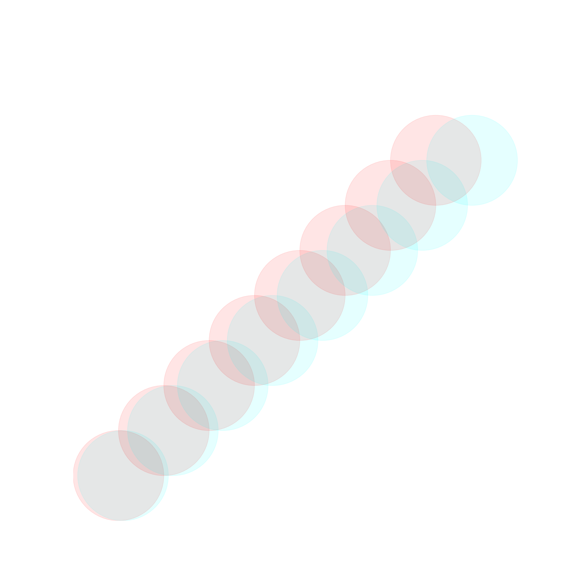
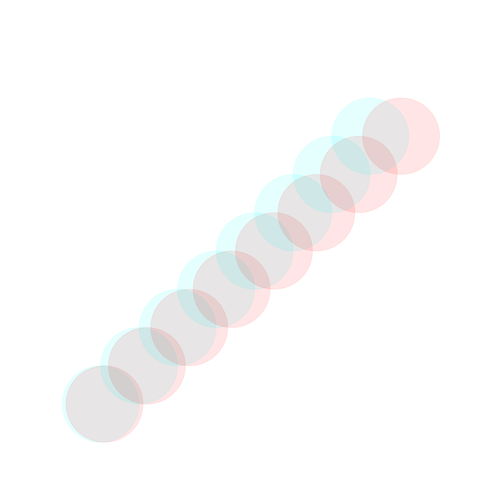
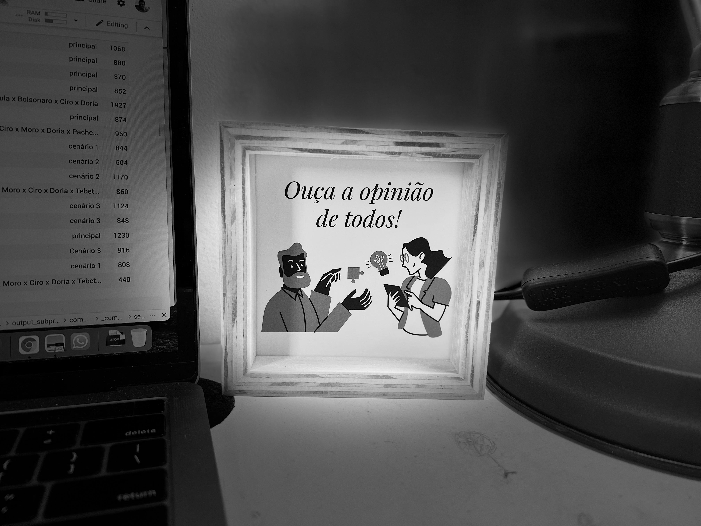
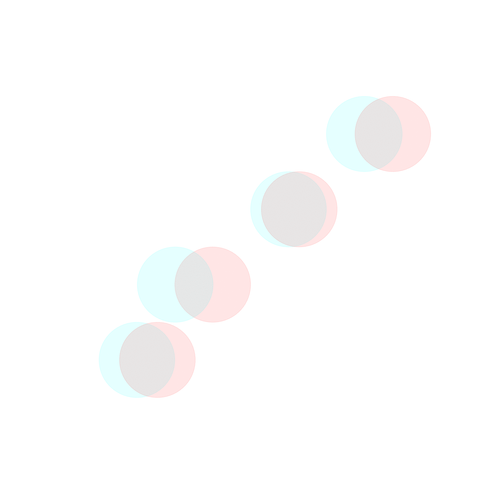
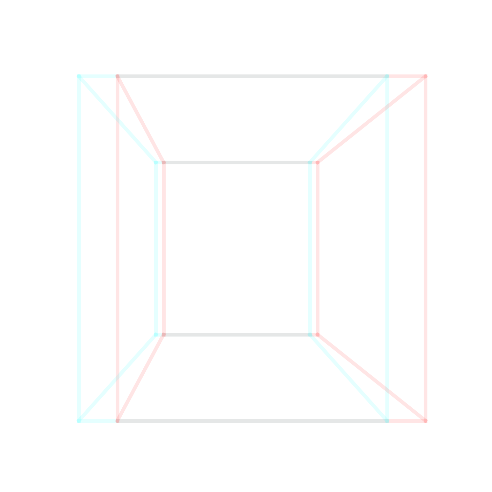
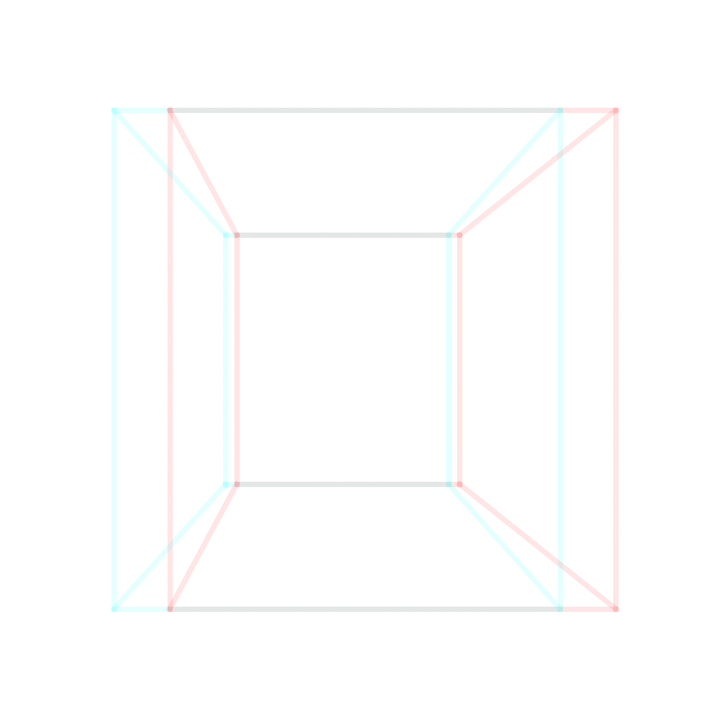
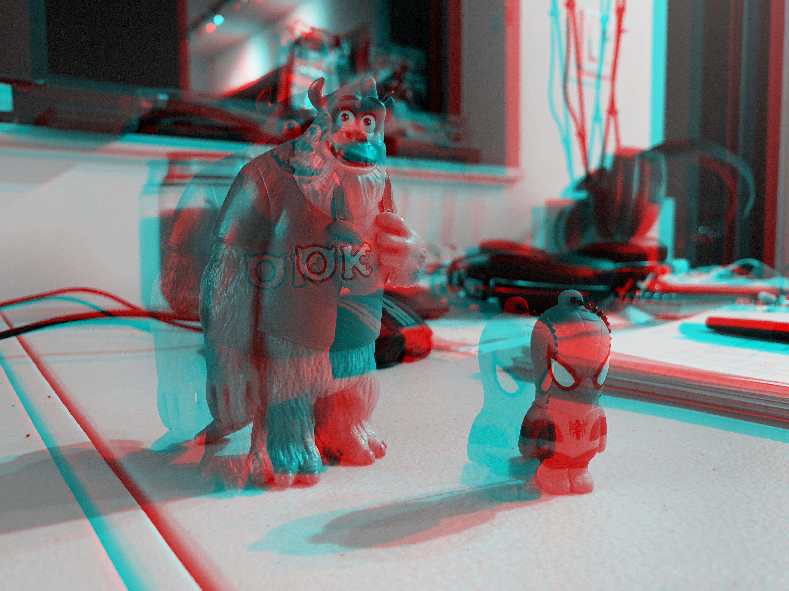
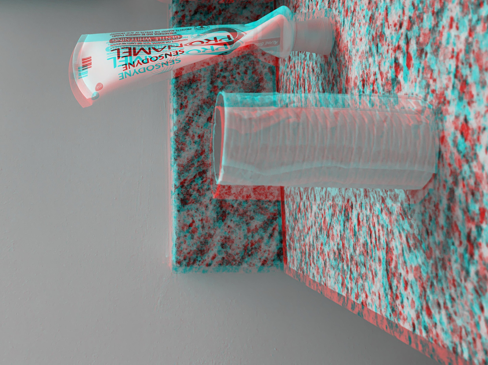
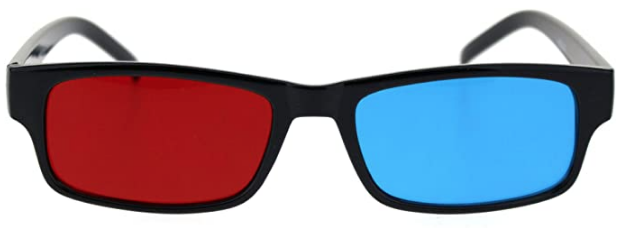

# 3D view

Anaglyphic glasses required to enjoy this 3D image :) (run 'python3 play.py'). The code could not get any simpler.

Or if you want to see modified [solar system](https://en.wikipedia.org/wiki/Solar_System) (numbers modified in order to show something nice). 3D math is heavily flawed as well, just for fun purposes. Run 'python3 play03.py'.

Or you can create [animated gifs](https://averagelinuxuser.com/make-gif-in-linux-with-one-simple-command/) with [ImageMagick](https://imagemagick.org/index.php). (run 'python3 play02.py')

run 'python3 play04.py'

run 'python3 play04b.py'

or if you combine two pictures taken from different positions, you can get this (combineImages.py):

You need 3D anaglyph glasses. Options:
* [Black Anaglyphic Red Blue Cyan Stereoscopic Lens 3D Glasses](https://www.amazon.com.br/encaixe-Artibetter-Visualizando-caseiros-moldura/dp/B07SPKQK6Q/ref=pd_sbs_sccl_1/147-8301524-7361809?pd_rd_w=i3gqw&pf_rd_p=1eb83ecb-3d38-4c15-9700-c733345d3c82&pf_rd_r=BKXDKH39K94FF34FRMW4&pd_rd_r=d361e3e2-4430-47fa-9dcf-5dd268d2a949&pd_rd_wg=AQ4em&pd_rd_i=B07SPKQK6Q&psc=1)
